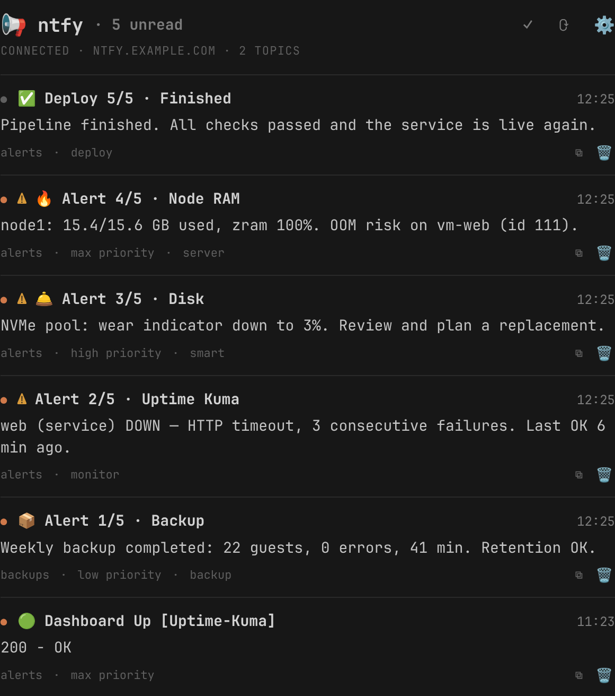

# ntfy para Omarchy

Widget de barra para Omarchy 4 que recibe las notificaciones de
[ntfy](https://ntfy.sh): cada mensaje que llega a tus temas sale como aviso de
escritorio y queda en un panel con el historial, los enlaces y los adjuntos.

Vale para el servidor público `ntfy.sh` y para uno propio, con o sin clave,
y con varios servidores a la vez.

El idioma de los textos sale solo de la configuración regional del sistema
(`LANG`): español e inglés en `i18n.js`; otro idioma es copiar un bloque. No
hay selector. Los avisos de escritorio llevan el título y el texto que manda
quien publica, en el idioma que sea.

*English version: [README.md](README.md).*



## Puesta en marcha

1. Habilitar el widget: `omarchy plugin enable safloresmo.ntfy`.
2. Abrir el panel y pulsar el **engranaje** (o la tecla `e`). Se abre el
   editor: una tarjeta por servidor con su nombre, la URL, los temas
   separados por comas y, si hacen falta, el token o el usuario y la clave.
   «Añadir servidor» pone otra tarjeta; el cubo la quita. `Ctrl+↵` guarda,
   `Esc` cancela.
3. Probar: con el panel abierto, la tecla `t` te publica un mensaje en el
   primer tema del primer servidor. O desde cualquier sitio:

   ```bash
   curl -d "Hola desde el taller" -H "Title: Prueba" -H "Tags: rocket" https://ntfy.sh/alertas
   ```

Se pueden seguir **varios servidores a la vez** (ntfy.sh y uno propio, por
ejemplo), cada uno con sus temas y sus credenciales. Con más de uno, cada
mensaje del panel dice de cuál viene.

Los temas de `ntfy.sh` son públicos por nombre: cualquiera que lo adivine
puede leer y escribir. Un nombre largo y raro es la única protección que hay
sin cuenta.

### El fichero de suscripciones

El editor escribe `~/.config/sfm/ntfy.conf` con permisos **600**, una sección
por servidor. Se puede editar a mano; el oyente se da cuenta solo y
reconecta:

```ini
[casa]
servidor = https://ntfy.midominio.es
temas = taller, alarma
token = tk_xxxxxxxxxxxxxxxxxxxxxxxxxxxxx
```

`ntfy.conf.example` en la carpeta del plugin trae el formato completo. Las
credenciales nunca van a los ajustes del shell, que son legibles.

`omarchy bar set safloresmo.ntfy topics a,b` (y `server`) sigue funcionando: el
oyente lo trata como un servidor más, «ajustes».

## Qué muestra

- **Barra**: el número de mensajes sin leer. Color de alerta **solo** si hay
  alguno sin leer de prioridad alta o máxima (4 o 5 en ntfy). Un problema de
  conexión o de configuración lleva un glifo de aviso, no solo color: en
  algunos temas el color de alerta contrasta menos que el texto normal.
- **Panel**: avisos arriba (sin temas, clave rechazada, sin conexión, fichero
  de credenciales abierto…) y un mensaje por fila, el más reciente primero:
  emoji de las etiquetas, título, texto, tema, prioridad, adjunto y enlace.
- **Aviso de escritorio**: uno por mensaje, con la urgencia según la prioridad
  de ntfy (1-2 baja, 3 normal, 4-5 crítica) y los emojis de las etiquetas
  delante del título, como en las apps de ntfy.

## Interacciones

| Dónde | Acción |
|---|---|
| Clic izquierdo | Abre el panel |
| Clic derecho | Marca todo como leído |
| Clic central | Reconecta |
| `↵` en el panel | Abre el enlace del mensaje; si no tiene, el adjunto; si no, copia el texto |
| `x` | Quita el mensaje del historial |
| `a` | Marca todo como leído |
| `c` | Copia el texto |
| `t` | Publica un mensaje de prueba en el primer tema |
| `r` | Reconecta |
| `e` | Abre el editor de servidores y temas |
| `1`-`9` | Salta al mensaje n |

Cerrar el panel marca como leído lo que había, como cualquier bandeja.

## Ajustes

Los servidores y los temas no son ajustes del shell: van en
`~/.config/sfm/ntfy.conf` (ver arriba). Lo demás:

| Clave | Por defecto | Qué hace |
|---|---|---|
| `notify` | `true` | Lanzar avisos de escritorio |
| `minPriority` | `1` | Prioridad mínima (1-5) para avisar; por debajo, solo al historial |
| `keep` | `200` | Mensajes que se guardan |

## Cómo funciona

`listen.sh` es un supervisor que lanza un oyente por servidor. Cada oyente
abre una conexión HTTP en flujo (`/json`) a sus temas y va escribiendo lo que
llega en `~/.local/state/sfm/ntfy/messages.jsonl` (bajo cerrojo, porque
escriben varios). El widget no habla con ntfy: vigila ese fichero, la marca
de leído, el fichero de suscripciones y el estado de cada conexión
(`$XDG_RUNTIME_DIR/sfm-ntfy/status`, un registro por servidor).

**Un solo oyente por sesión.** El shell instancia cada widget una vez por
monitor; si cada uno abriera su conexión, cada mensaje avisaría tantas veces
como pantallas. El script toma un cerrojo (`flock`) y los que no lo consiguen
salen; el widget reintenta cada minuto por si el supervisor muere. Si el que
escucha lo hace con otros ajustes o con un script más viejo, se le releva. Un
cambio en las suscripciones no necesita nada de eso: el supervisor ve cambiar
el fichero y relanza los oyentes.

**No se pierde nada al reconectar.** Antes de abrir el flujo se hace un
sondeo `since=<último mensaje guardado>`, que trae lo que llegó mientras no
había conexión y avisa de ello. Solo la primera vez, sin historial, se coge la
caché del servidor sin avisar: es viejo. La deduplicación va por `id`.

**Solo lectura.** Las `actions` que puede traer un mensaje de ntfy (abrir
URL, hacer una petición HTTP, mandar un broadcast) ni se ejecutan ni se
guardan: se filtran al entrar. Del mensaje se guardan solo los campos que se
enseñan. Lo único que publica el plugin es el mensaje de prueba de la tecla
`t`.

**Sin dependencias nuevas**: bash, curl, jq, flock y notify-send, todo del
sistema base. Los formatos de red y de fichero están en
[docs/PROTOCOL.md](docs/PROTOCOL.md) (en inglés).

## Depuración

```bash
~/.config/omarchy/plugins/safloresmo.ntfy/listen.sh check
```

Enseña cada servidor con sus temas, su tipo de credencial y su estado, y el
del supervisor.

Los demás modos (`read`, `clear`, `delete <id>`, `send [texto]`, `write-conf`)
son los que usa el panel; se pueden lanzar a mano.
